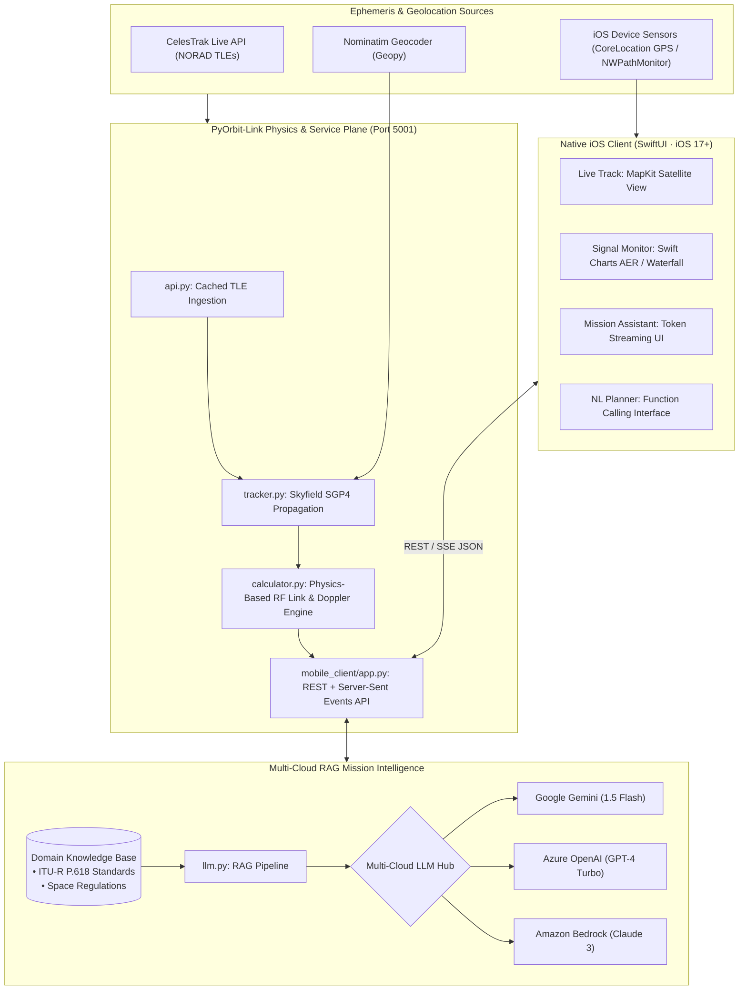

# PyOrbit-Link: LEO Satellite Ephemeris Tracker, RF Link Budget Toolkit & Native iOS App 🛰️

> **Full-stack aerospace telecommunications platform bridging SGP4 orbital mechanics, Ka/V-band RF link budgeting, multi-cloud RAG mission intelligence, and a production-grade native SwiftUI iOS flight companion.**

[](https://www.python.org/)
[-black.svg)](https://developer.apple.com/xcode/swiftui/)
[](https://rhodesmill.org/skyfield/)
[-green.svg)](#-rf--telecommunications-formulations)
[-purple.svg)](#-multi-cloud--rag-mission-assistant)
[](#-executive-summary--aerospace-thesis)
[](LICENSE)

---

## 🧭 Executive Summary & Aerospace Thesis

Low Earth Orbit (LEO) satellite communications represent a paradigm shift from traditional geostationary (GEO) architectures. Operating at altitudes between 300 km and 1,200 km, LEO constellations (e.g., **Amazon Project Kuiper**, **SpaceX Starlink**) achieve round-trip latencies below 30ms. However, this proximity introduces formidable systems challenges:
1. **Dynamic High-Velocity Doppler Shifts:** Orbital speeds of ~7.5 km/s induce severe frequency shifts ($\pm 50 \text{ to } 75 \text{ kHz}$ at Ka/V-band), necessitating real-time carrier frequency correction.
2. **Rapid Slant-Range & Path Loss Variations:** Free-Space Path Loss (FSPL) fluctuates dynamically by up to 15 dB as a satellite transits from horizon ($10^\circ$ elevation) to zenith ($90^\circ$).
3. **Severe Atmospheric & Rain Fade:** Millimeter-wave links (Ka-band at 26–40 GHz and V-band at 40–75 GHz) suffer heavy hydrometeor and gaseous absorption modeled according to ITU-R P.618 standards.

**PyOrbit-Link** provides aerospace systems and RF engineers with an end-to-end analytical framework. It couples NORAD Two-Line Element (TLE) acquisition, high-precision SGP4 orbit propagation, and physics-based RF link budgets with a **production-grade native iOS client** and a **multi-cloud RAG mission assistant**.

---

## 🏛️ System Architecture



---

## 📐 RF & Telecommunications Formulations

### 1. Free-Space Path Loss (FSPL)

Free-Space Path Loss models isotropic signal dissipation over slant-range distance $d$ at carrier frequency $f$:

$$\text{FSPL (dB)} = 20 \log_{10}(d) + 20 \log_{10}(f) + 20 \log_{10}\left(\frac{4\pi}{c}\right)$$

Where $c = 299,792,458 \text{ m/s}$ is the exact speed of light in vacuum.

### 2. Relativistic Orbital Doppler Shift

Frequency displacement $\Delta f$ induced by relative line-of-sight velocity vector $\mathbf{v}_{\text{rel}}$:

$$\Delta f = -f_0 \cdot \frac{\mathbf{v}_{\text{rel}} \cdot \hat{\mathbf{r}}_{\text{LOS}}}{c}$$

At Ka-band frequencies ($f_0 \approx 28 \text{ GHz}$), Doppler shifts frequently exceed $\pm 65 \text{ kHz}$, requiring digital phased-array frequency tracking at the ground terminal.

### 3. Parabolic Antenna Gain

Directive antenna gain $G$ derived from physical aperture diameter $D$, aperture efficiency $\eta$ (nominal 0.60), and wavelength $\lambda = c / f$:

$$G(\text{dBi}) = 10 \log_{10}\left( \eta \cdot \left(\frac{\pi D}{\lambda}\right)^2 \right)$$

### 4. Carrier-to-Noise Ratio (CNR) Link Budget

$$\text{CNR (dB)} = \text{EIRP} - \text{FSPL} - L_{\text{atm}} + \left(\frac{G}{T}\right) - 10 \log_{10}(k) - 10 \log_{10}(B)$$

Where:
- $\text{EIRP} = P_{\text{tx}} + G_{\text{tx}}$ is the Equivalent Isotropically Radiated Power.
- $L_{\text{atm}}$ models ITU-R P.618 atmospheric gaseous absorption and rain fade clamped at low elevation angles ($\theta \ge 1^\circ$).
- $G/T$ is the receiver figure of merit (antenna gain over system noise temperature).
- $k \approx 1.380649 \times 10^{-23} \text{ J/K}$ is Boltzmann's constant.
- $B$ is channel bandwidth in Hz.

### 📊 Sample Ka-Band Downlink Budget Breakdown (28 GHz)

| Parameter Description | Variable / Symbol | Nominal Value | Unit | Engineering Impact |
| :--- | :--- | :--- | :--- | :--- |
| **Carrier Frequency** | $f_0$ | **`28.0`** | GHz | Ka-band high-throughput downlink |
| **Orbit Slant Range (Zenith)** | $d$ | **`550.0`** | km | LEO nominal orbital altitude |
| **Free-Space Path Loss** | $\text{FSPL}$ | **`-176.2`** | dB | Primary geometric signal dispersion |
| **Atmospheric & Rain Attenuation** | $L_{\text{atm}}$ | **`-2.4`** | dB | ITU-R P.618 clear sky + moderate rain |
| **Satellite EIRP** | $\text{EIRP}$ | **`+52.0`** | dBW | Phased-array transmit aperture power |
| **Ground Receiver G/T** | $G/T$ | **`+18.5`** | dB/K | 60cm parabolic reflector dish |
| **Channel Bandwidth** | $B$ | **`250.0`** | MHz | Wideband data channel |
| **Resulting CNR Margin** | $\text{CNR}$ | **`+14.8`** | dB | Exceeds QPSK/8PSK demodulation threshold |

---

## 📱 Native iOS Client Architecture (`iOS/PyOrbitLink/`)

Built natively in Swift 5.9 and SwiftUI for iOS 17.0+:

| Screen / Feature | Native Frameworks | Capabilities |
|---|---|---|
| **1. Live Track** | `MapKit` (iOS 17 API), `CoreLocation` | Real-time 2D orbital map with ground observer pin and ISS satellite trajectory. |
| **2. Signal Monitor** | `Swift Charts` | Dynamic AER time-series, polar radar azimuth/elevation sky view, and RF link budget waterfall. |
| **3. AI Mission Chat** | `URLSession` async/await, SSE | Token-by-token streaming RAG flight analyst responses with animated cursor. |
| **4. Mission Planner** | Natural Language Parser | NL2Function parser converting plain English into mission parameters. |
| **5. Anomaly Alerts** | `UserNotifications` | Real-time warnings when link margins degrade below thresholds. |

### 📱 Client Architecture Comparison: Native SwiftUI vs. Web Client

| Feature Domain | Native SwiftUI iOS App (`iOS/PyOrbitLink`) | Python / Flask Web Client (`mobile_client/`) |
| :--- | :--- | :--- |
| **Rendering Engine** | Native Metal-accelerated MapKit & Swift Charts | Browser DOM & HTML5 Canvas |
| **Sensor Telemetry** | CoreLocation GPS + NWPathMonitor Cellular/WiFi | HTML5 Geolocation API |
| **Offline Capabilities** | Pre-computed demo passes (ZIP 91356-4144) | Requires local server loopback |
| **Streaming UI** | Low-latency URLSession async SSE event consumer | Fetch API EventSource stream |
| **Target Role** | Field technician & flight operations companion | Headless REST automation & cross-platform testing |

---

## 🔬 Multi-Cloud RAG Mission Assistant

PyOrbit-Link integrates a decoupled AI telemetry analyst capable of running against **Google Gemini**, **Azure OpenAI**, or **Amazon Bedrock**:
1. **Streaming Telemetry Analysis (`GET /api/simulate/stream`):** Server-Sent Events (SSE) push token-by-token engineering commentary as the pass unfolds.
2. **Contextual Multi-Turn Chat (`POST /api/chat`):** Server-side session memory allowing flight controllers to query pass snapshots (e.g., *"Why did CNR drop below 8 dB at elevation 12°?"*).
3. **NL2Function Mission Planner (`POST /api/plan`):** Parses plain-language flight instructions (*"Track ISS from Paris with Ka-band link budget"*) into validated parameters using strict schema allowlists.
4. **Autonomous Anomaly Detection (`GET /api/alerts`):** Threaded background watcher evaluating rolling link saturation and Doppler margins.
5. **Grounded Standards Briefings (`GET /api/briefing`):** Exports technical Markdown briefings grounded in `knowledge_base/sat_standards.txt`.

---

## 📂 Repository Topology

```text
PyOrbit-Link/
├── README.md                      # Executive Platform Specification
├── GUIDE.md                       # Comprehensive User & Operations Manual
├── requirements.txt               # Production Python dependencies
├── pyorbit_link/                  # Core Systems Engine
│   ├── tracker.py                 # SGP4 orbit propagation & pass prediction
│   ├── calculator.py              # FSPL, Doppler, antenna gain, atmospheric losses, CNR
│   ├── visualizer.py              # Polar sky-track plotting (Matplotlib)
│   ├── api.py                     # CelesTrak TLE fetching with timeout protection
│   ├── utils.py                   # LRU-cached reverse geocoding
│   ├── llm.py                     # Multi-cloud RAG mission assistant
│   ├── planner.py                 # Ground pass planning engine
│   └── monitor.py                 # Continuous link margin telemetry watcher
├── mobile_client/
│   ├── app.py                     # Flask REST + SSE application (Port 5001)
│   └── templates/                 # Mobile-responsive web UI fallback
├── iOS/PyOrbitLink/               # Native iOS 17+ SwiftUI Application
│   ├── PyOrbitLink/               # App entry, views, view models, network services
│   └── PyOrbitLink.xcodeproj      # Xcode project configuration
└── examples/
    └── advanced_features.py       # Full-spectrum desktop pass prediction demo
```

---

## 🚀 Quickstart & Validation

### 1. Backend Server Setup

```bash
git clone https://github.com/hoomanp/PyOrbit-Link.git
cd PyOrbit-Link
python3 -m venv .venv && source .venv/bin/activate
pip install -r requirements.txt
```

### 2. Launch the Backend API (Port 5001)

```bash
export FLASK_SECRET_KEY="c2VjdXJlX2tleV9leGVjdXRpdmVfc2VsZWN0"
export SAT_AI_PROVIDER="google"      # Or: azure, amazon
export GOOGLE_API_KEY="your-gemini-key"
export PORT=5001

python3 mobile_client/app.py
```

### 3. Open Native iOS App

Open `iOS/PyOrbitLink/PyOrbitLink.xcodeproj` in Xcode 15+, select iPhone 15/16/17 simulator or physical device, and run (`Cmd + R`).

---

## 📄 License & Attribution

Distributed under the **MIT License**. Engineered and architected by **Hooman Parta** ([@hoomanp](https://github.com/hoomanp)).
